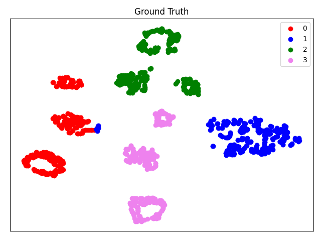
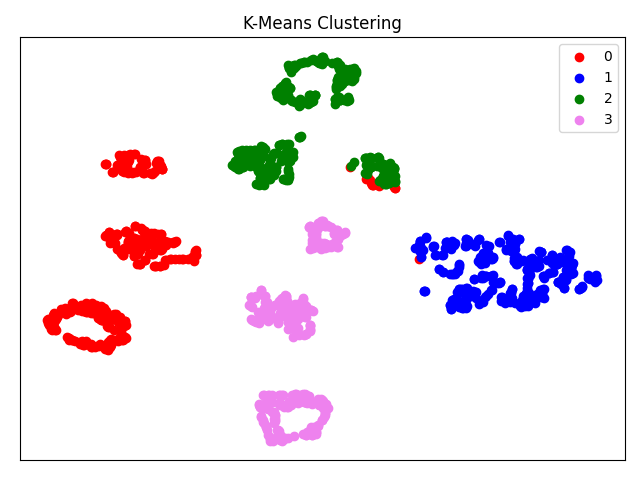

# Abnormal_Situation_Clustering

## Enviroment setup

To install requirements:
```
pip install -r requirements.txt
```

## Train

To train convolutional neural network (embedding):
```
cd Code
python TRAIN_crossentropy.py # for training unsupervised setting
python TRAIN_crossentropy_finetune_with_supcon.py # for finetuning
```


## Evaluation

To evaluate and visualize:
```
cd Code
python VISUALIZE_crossentropy.py
```
<div align="center">
  
  
</div>
<div align="center">
  Clustering Results before finetuning.
</div>

To evaluate and visualize:
```
cd Code
python VISUALIZE_crossentropy_finetune_with_supcon.py

```
<div align="center">
  
  
</div>
<div align="center">
  Clustering Results after finetuning.
</div>

